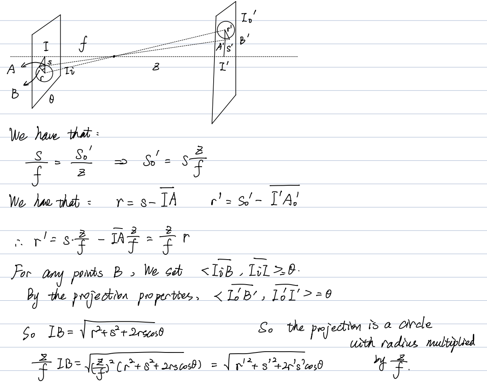
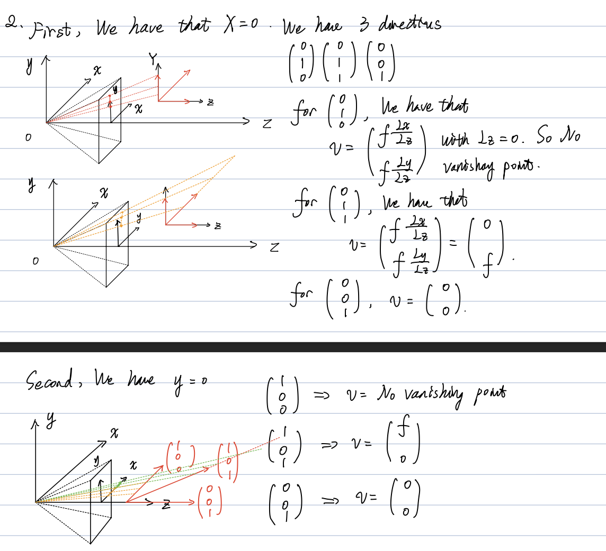
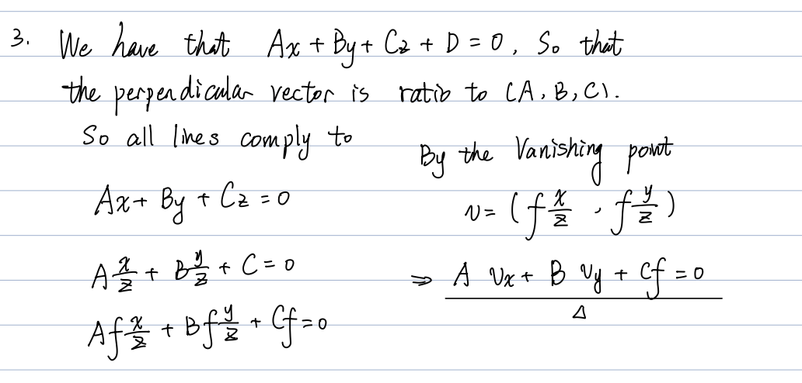

# Computer Vision Homework

This is the report of the computer vision homework. We have the following parts:

## Contents

- Writen assignments.
- Coding reports.

## Part 1: Written homework

Question a:



Question b:



Question c:



## Part 2: Coding assignment

`binarize(image)`: I used 128 to get a good binary image. The output is a binary image.

`label(binary_image)`: First we labeled the image by 4 neighbors rule, then we use the **union set** to propagate the labels in the connected components.

`get_attribute(labeled_image)`: We generated the dictionary and has the following outputs:

two_objects.png

```txt=
object 1
label: 1
position: (350.332985, 216.453654)
orientation: -1.259957
roundedness: 0.533632
----------------------
object 2
label: 18
position: (196.316047, 223.382094)
orientation: 0.687546
roundedness: 0.479964
----------------------
```

many_objects_1.png

```txt=
object 1
label: 1
position: (189.351562, 357.900331)
orientation: -0.643142
roundedness: 0.007634
----------------------
object 2
label: 8
position: (332.961798, 338.217695)
orientation: -1.53092
roundedness: 0.307267
----------------------
object 3
label: 86
position: (476.339982, 339.967168)
orientation: 0.403247
roundedness: 0.020855
----------------------
object 4
label: 164
position: (414.655669, 204.951377)
orientation: -1.117909
roundedness: 0.173944
----------------------
object 5
label: 234
position: (131.161577, 188.152294)
orientation: -1.448381
roundedness: 0.507877
----------------------
object 6
label: 283
position: (266.967141, 169.646221)
orientation: -0.492969
roundedness: 0.480912
----------------------
```

many_objects_2.png

```txt=
object 1
label: 1
position: (266.976166, 365.134019)
orientation: 0.080427
roundedness: 0.52172
----------------------
object 2
label: 87
position: (462.643081, 313.750436)
orientation: 1.263563
roundedness: 0.990266
----------------------
object 3
label: 120
position: (327.015439, 309.294737)
orientation: 0.778839
roundedness: 0.133195
----------------------
object 4
label: 136
position: (418.716207, 241.291814)
orientation: -0.776024
roundedness: 0.024422
----------------------
object 5
label: 152
position: (269.308282, 257.853272)
orientation: -0.538837
roundedness: 0.486073
----------------------
object 6
label: 166
position: (304.571395, 178.273008)
orientation: 0.405202
roundedness: 0.270271
----------------------
```

`detect_edges(gray_image)`:

Before we detect edges, we pass the image through a gaussian filter to constrain its noise.

We use sobel operators as follows:

$$
\begin{align*}
G_x=\begin{bmatrix}
        -1 & 0 & 1\\
        -2 & 0 & 2\\
        -1 & 0 & 1
\end{bmatrix},G_y=
\begin{bmatrix}
        1 & 2 & 1\\
        0 & 0 & 0\\
        -1 & -2 & -1
\end{bmatrix}
\end{align*}
$$

Then we use a approximate calculator $G=\left|G_x\right|+\left|G_y\right|$.

To approach the official sobel detector we use **reflect padding** instead of **zero padding**.

`hough_circles(edge_image)`:
We use the array of radius: [1,2,$\cdots$,41] to do the hough transformation. The hough transform result was in the directory: `./CV_HW1/hough_transform`

`find_circles(image, accum_array, radius_values, hough_thresh)`:

The output was in the `./CV_HW1/output`.
